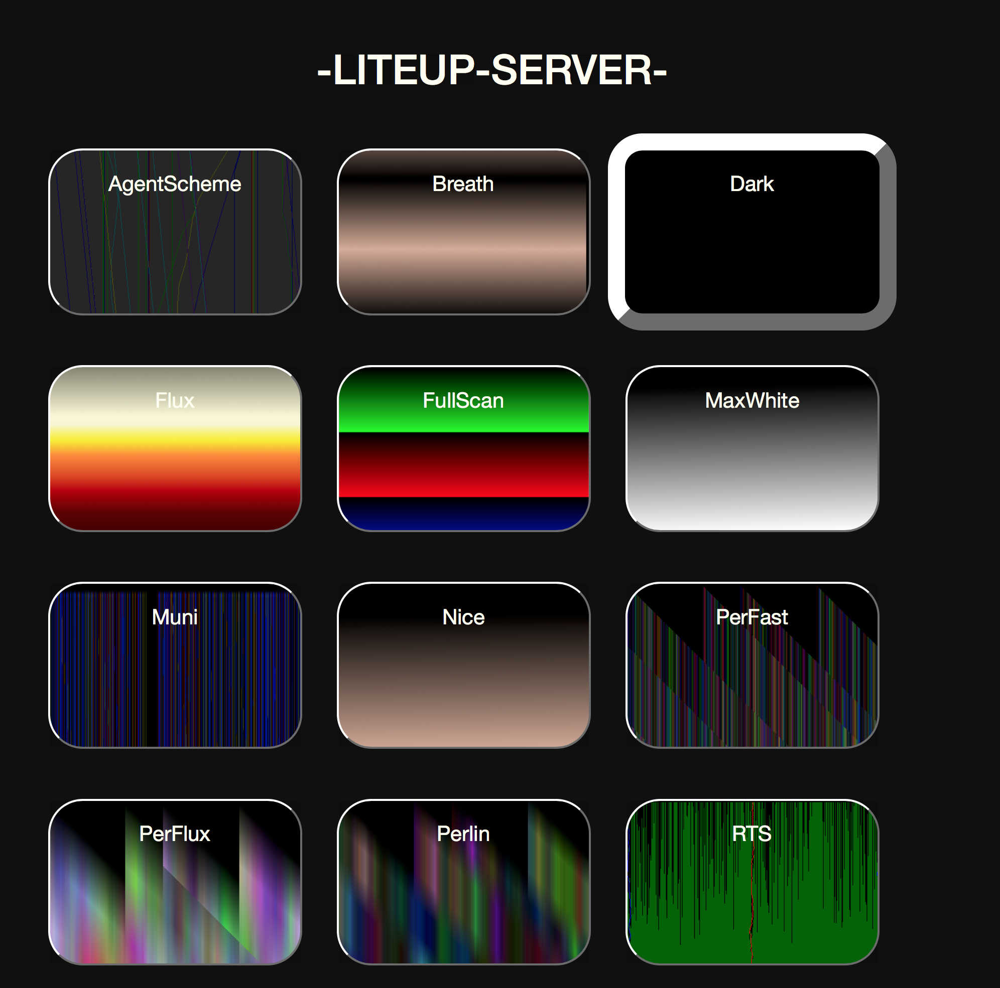

# Liteup



This library should let you create a web-controlled APA102 LED strip, with logic driven by a Raspberry Pi.

It's written entirely in python and designed to be easily modifiable.
  Please feel free to clone, fork, or contribute

This is going to be demo'd in the upcoming PyCon talk ["Visualizing Algorithms with Python and Programmable LEDs"](https://us.pycon.org/2018/schedule/presentation/131/)

Here are the slides from that talk: https://docs.google.com/presentation/d/e/2PACX-1vQk2sNPeNrV9uI6Gb6B8F0TzFMVhpD8hNFRbX50B1zFFnGC-MEbzM0hk_cpTCMSnfca-BND-bx0loFB/pub?start=false&loop=false&delayms=3000
I will post the video when it is available.

## Setup

This is designed to be run on a raspberry pi, but it may be possible to run it on other similar boards.

### Install
To install, I believe you can use pip. I clone and then do `pip install -d .`  This library is not distributed on pip yet, so you must clone it first.

You may encounter an issue with the spidev library if you are installing on a Mac/not a pi. That's the hardware interface library and it is not available for platforms without SPI headers. You can comment it out of the setup.py if you want to install there. There's a debug mode that makes programming light patterns away from hardware possible.


### Client
There's also the client library. That is the program that actually controls the LEDs, and is designed to be run on the Pi.
It can be used in conjunction with a server, or as a standalone CLI script.

```python liteup/client.py sorts```

There are many useful and cool themes that I've written, and I've tried to make it easy to add more.

### Server

There's a server component, which gives you a webpage that can control the LED pattern.
That can be hosted on any website, and even the pi itself.
You can configure the client to look for commands from any web address, but it will default to localhost.

```python liteup/server/server.py```

This library expects python 3.6 or above.

Please open an issue if you encounter any problems while installing. This is a process that I want to make smoother. 

## Hardware
This uses APA102 strips, which can be purchased from a variety of places. I recommend Amazon, Aliexpress and Adafruit, in that order.

Once you have your strip, and your pi, I recommend setting it up as described in [Tinue's APA102_Pi readme](https://github.com/tinue/APA102_Pi).
I have followed that pretty much exactly, with the exception that I did not use a level shifter chip, I feed the data and clock directly from the Pi into the strip. This has not given me a problem to date.


## Extensions

Each light pattern is called a Scheme, and is a python class that inherits from `schemes/scheme.py:Scheme`. There's an `init` function that is called once to set it up, and then a `paint` function that is called over and over again to generate the led strips patterns.  If `paint` returns True, the strip will be redrawn.  Modify/call functions on `self.strip` within a Scheme class to generate the pattern.


I recommend reading easy_schemes.py first, and then copying those to make your first schemes. Schemes can get quite complicated and include any arbitrary python including API calls, but that's a good starting place to see the interface. There are lots of helper methods in /lib/ and scheme.py that can help you do things like convert between colorspaces, gamma correct, paint a uniform color, etc.


### Future Development
This project is at a nice place now, and I use it for daily room lighting, but I would like to improve it. Ideally, each scheme would be able to define any options that it wants, and have the server present those options to the user to control the details of the scheme. The bones of this are in place, but it should be fleshed out.
I would also like to make some longer running schemes with emergent behavior. 

---
### Thanks Tinue
Liteup contains a a fork of the great [APA102_Pi library by tinue](https://github.com/tinue/APA102_Pi).

It contains a lot of code from APA102_Pi, but also a significant number of more themes, as well as a server and client for web-control, and extensions from APA102_Pi.
